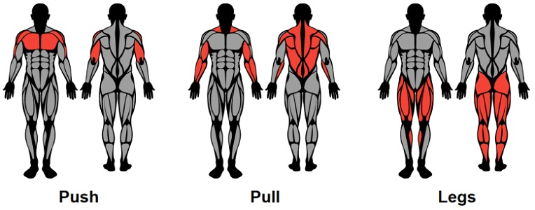

# Stacks in C#

When we think of a stack what do we think about? Perhaps we think of a stack of paper or a stack of pancakes. But what is a stack in C#? A stack in C# and other programming languages or concepts, is the idea of processing the order of which items are added or removed using "Last in, First Out." This is often shortened to "LIFO". 

## Stack of Dinner Plates

We can visualize the stack by thinking about a stack of dinner plates. Let's say we just finshed a load of dishes that we want to put away. We start with one dinner plate in the cabinet and continue to stack the remaining dinner plates on top of eachother until all of the plates have been put away. Well now it's dinner time, and we need to set the table. Which plates do we grab? We don't grab from the middle, and you'd be psychotic to pull from the bottom. No, we grab the top plate and keep going until we have enough plates for dinner. In this way a stack of tableware acts like a stack. To reach something at the bottom we must first remove what is at the top. Then once we have finshed gathering enough dinner plates, we can push all of the items we removed back up to the top of the stack of tableware.


## Common Operations

We can create a stack in C# by using the following syntax:
```c#
    Stack myStack = new Stack();
```

Once the stack is created we can perform a few helpful operations. Some popular operations are:
1. Push
2. Pop
3. Size
4. Empty

Pushing to the stack simply means adding something to the stack. Like you're pushing a dinner plate to the top. This operation can be performed with:
```C#
    var myStack = new Stack();
    myStack.Push(value);
```

To Pop the stack means to remove the last item from the stack. You can use this operation to simply remove something from a stack, but it is also useful to remove that item and store it into a variable. This operation is performed with:
```C#
    myStack.Pop();  // Removing last item in stack
    var value = myStack.Pop();  // Removing last item and storing it in a variable.
```

Size simply returns the amount of items or elements in the stack. This function can be accessed in C# with:
```C#
    var length = myStack.Count();
```

The final operation is Empty, which returns true if the current stack is empty. It is accessed in C# with:
```C#
    if (myStack.Count == 0);
```
## Efficiency
While stacks may be less versatile than lists, they are a great structure to solve ordered problems as the efficiecy of each of these operations is O(1).

##  Cramped Dinner Party Driveway


Let's say you are hosting a grand dinner party at your home. However, you only have a one car wide driveway. Once the party is over you know it will be a mess for the attendees leaving. You don't want to waste time with guests figuring it out for themselves, so you write a program using the stack to keep track of the order in which guests need to leave.

```C#
    var carStack = new Stack();  // This line of code is O(1)
```
Once this stack is created, as guests filter in we need to only push a new value into our stack. Let's say Jeff and his wife are the first to arrive. We would then push a value representing Jeff and his wife onto our stack. For this example, we will use first names.
```C#
    var personName = "";
    personName = Console.ReadLine();    // in this case personName is Jeff
    carStack.Push(personName);  // O(1)
```
This puts Jeff at the bottom of the stack, meaning he must be the last one to leave. 
As guests arrive we will use the same code to add each person to our stack.
```C#
    carStack.Push(personName);    // O(1)
```
Once the party is over, we can quickly find the order of who need to leave first with the Pop operation. Let's say the last person to arrive was Sharon our follow code should print to the console "Sharon".
```C#
    nextPerson = carStack.Pop();  // Both O(1)
    Console.Writeline(nextPerson); // Expect: "Sharon"
```
Knowing this we know that Sharon has got to go and kick her out of the party first, poor Sharon. 

Now in order to make this easier and print out the entire order of who needs to leave, we can use the following code:
```C#
    Console.WriteLine("Partygoers should leave in this order: ")
    for (int i = 0 ; i < myStack.Count ; i++){  // While the stack operation itself is
        Console.Writeline(carStack.Pop());      // O(1), since we are using a loop the
    }                                           // overall time is O(n)
```
This would then print out the exact order in which party goers need evacuate, as the last ones who arrive, need to be the first ones to leave.

An example of the following can be implemented like this:
```
    Who has arrived?
    > Jeff
    Who has arrived?
    > Robert
    Who has arrived?
    > Chase
    Who has arrived?
    > Sharon
    Partygoers should leave in this order:
    Sharon
    Chase
    Robert
    Jeff
```

Now I know you're thinking this is a lame party if it's only 4 people, but this code can be useful for any size of attendees, which is why it's so useful.

## Workout Stack



You are getting ready for your weekly workout plan, but you need helping keeping track of what muscle group you are working out each day. You want to make sure that the muscle group you are planning on exercising today was not the same you did when you last worked out. You plan on working out 3 times this week, and there are 3 possible muscle groups to exercise. You want to follow the pattern of: Push, Pull, Legs. So after every leg day is a push day, after every push day is a pull day, etc. Write a program to choose the next workout depending the last workout using stacks.

and exmaple execution of the program is:
```
Choose your first workout: 0 = Push, 1 = Pull, 2 = Legs
> 2
The first workout is Legs
The next workout is Push
The final workout is Pull

```

Once you are done solving this problem, you can find the solution [here.](code_solutions.md#solution-for-the-workout-problem)
