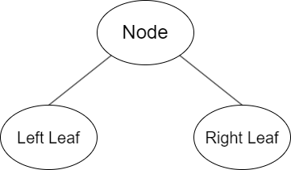
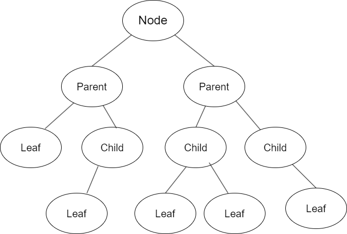
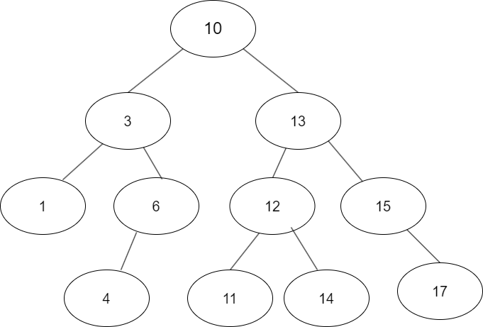
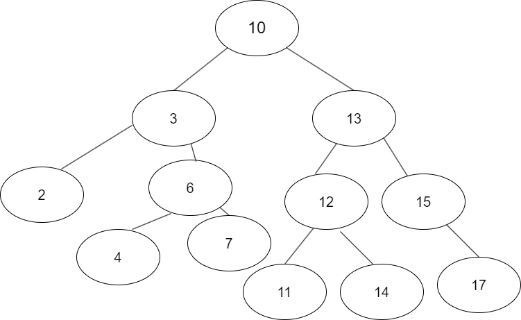
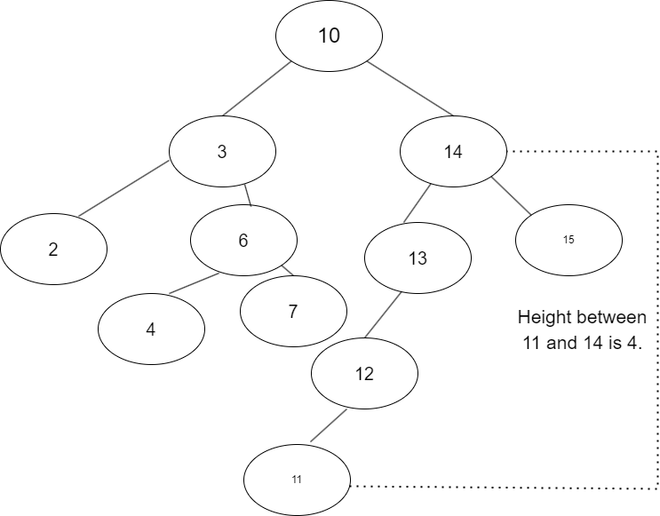
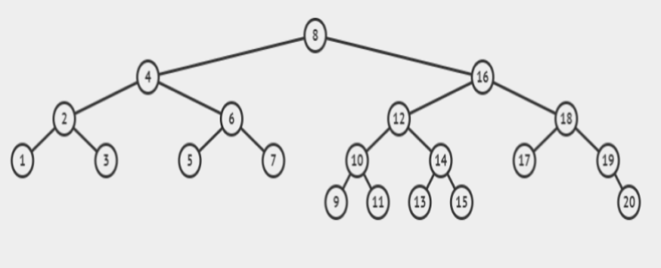

# Recursion

Before we can understand trees, we need to know two things. Linked Lists, and recursion. We've already learned about Linked Lists this tutorial, so I will breifly go over recursion. To put it simply, recursion is when a function calls itself. This is used a lot in trees. In order for recursion to be infinite, we need a base case in our function, when the function reaches its base case, it will stop recusively calling itself and allow the function call stack to complete. A simple recursive call is shown below:


```C#
    static void printNum(int n){
        // base case
        if (n < 0){
            return;
        }
        Console.WriteLine(n);
        printNum(n-1);  // recursive call
        Console.WriteLine(n);
    }

```

This is a simple function, we can see our base case is when n is less than 0. Once n is 0, the function will simply return and no longer recursively call. The output of this function if n is equal to 10, would be counting down from 10 to 0, then 0 to 10.

# What is a Tree?

I mean this seems pretty simple, just look outside, most areas have trees. Unless of course you live in the unfortunate state of North Dakota (I googled state with the least amount of trees so blame Google not me). Specifically I am talking about Trees as a data structure. Trees are the most complex data structure, but if you understand Linked Lists, you can understand trees. If you need a refresher on Linked Lists, click [here](#what-is-a-linked-list). Trees are similar to Linked Lists as they are composed of Nodes. However instead of a next node, tree nodes have different pointers to other nodes, which are called "leaf nodes" or "child nodes". The most popular and applicable tree is a binary tree, which is a tree that has a left and a right leaf node.
### Tree Leaf Nodes


In a binary tree you start with a root node, like the root of a tree. If a node has leafs it is considered a child node of the node above it. If a node doesn't have leaves it is just a leaf node, like the example above. The following is an example of a binary tree with multiple child and leaf nodes. 
### Binary Tree


Trees, like people, can have all different shapes and sizes, such as skewed trees, where most of the data lies on one side of the root node. Or a long skinny tree with long skinny branches. In this case the tree is fairly balanced on both sides.

## Binary Search Trees
For the purposes of programming the most popular tree is a binary search tree. A binary search tree is a tree that orders its data by the parent node. If the data is more than the parent node, it will be placed in the right subtree, if it is less it will be placed on the left.

Consider our previous tree, let's first populate it with data. 

### Binary Search tree


Now we want to add the number "7" in our tree, where would we place this number? Well, we check our root node, which is 10, hopefully see that 7 is indeed less than 10. Next we check our next node, which is 3, well 7 is definetely larger than 3, and it is also larger than 6, so it would be placed in the node to the right of the node containing 6. 

### Updated Binary Search Tree


Notice all of the examples so far have been balanced trees. This is on purpose because this balanced design is how we achieve the most efficient time complexity. Imagine a tree is heavily skewed right, so much so that it ends up looking more like a Linked List. If we were to iterate through this tree, it would be closer to O(n) in time complexity, vs O(log n) if it was a balanced tree.

# Balanced Binary Search tree
One of the more popular BSTs is an AVL tree, which maintains its balance by making sure the distance between subtrees is less than 2. The distance between two nodes is called the height, if we look at our updated BST, we can see that the height between subtrees is always less than 2, making it balanced. The following is an example of an unbalanced tree, as the height between the 11 node and the closest parent node is 4.



# Common BST Operations

Since this section is already long I will condense the popular operations into a table similar to the Linked List's table:

| Operation        | Efficiency & Description                                                                    |
|------------------|---------------------------------------------------------------------------------------------|
| insert(value)    | O(log n) Uses recursion to search the tree and find next available spot.                    |
| remove(value)    | O(log n) Recursively searches for value to remove it and adjust pointers.                   |
| contains(value)  | O(log n) Recursively searches for value and returns true if found                           |
| traverse_forward | O(n) Recursively traverses left tree then right tree.                                       |
| traverse_reverse | O(n) Recursively traverses right first, then left tree                                      |
| height(node)     | O(n) Recursively searches to find height of left and right subtrees. Returns largest value. |
| size()           | O(1) Returns the size of the BST. From root to lowest leaf                                  |
| empty            | O(1) Checks size to determine if 0 Returns true if the BST is empty.                        |


Review the [BST class](BST.md#bst-class) and the [Node class](BST.md#node-class) found under the BST.md file to see how we can implement a BST in C#. Pay particular attend to the function and method names as they are different from that described in the table. For example, traverse_forward is implemented as TraverseForward. You may use these implementations in your own solutions or create your own.

# Example Problem
You are a genetic counselor, and you want to keep track of relations on your mother's side. Let's say for convenience sake everyone on your mother's side of the family comes from a household of two. So each parent node will be the mother of a family, and the child nodes will be the two children of each family. Let's say we have our family tree on our mother's side that contains 20 people. You want to be able to find the lowest common ancestor between two people or nodes, to see the relation between them.

For this problem we will need to use the node class found in BST.md.

```C#
    public class Node{
    public int Data { get; set; }
    public Node? Right { get; private set; }
    public Node? Left { get; private set; }

    public Node(int data){
        this.Data = data;
    }
}
```

With this node we can construct an additional function on our BST class to find our lowest common ancestor. Let's say our BST looks like this:


These numbers represent people in our mothers side of the family and We want to be able to find the lowest common ancestor of any 2 numbers.

Let's start by creating our binary tree class.

```C#
    public class BinaryTree{
        public Node root;
    }
```

This is very similar to the example we have in the BST.md file. Now we can create our lowest common ancestor search function. We do this by using recursion. First we have our base case, which is when we reach the end of the BST. We need to also write code to receive inputs

```C#
    int n1 = 0;
    int n2 = 0;
    Console.WriteLine("Enter the first number: ")
    n1 = int.Parse(Console.ReadLine());
    Console.WriteLine("Enter the second number: ")
    n2 = int.Parse(Console.ReadLine());

    public Node lowestCommonAncestor(Node node, int n1, int n2){
    if (node == null){
        return null;
    }
```

Now when we reach the end of the tree the recursion will stop so we don't have continuous recursion. Next we can use recursion with condition checks to find the lowest common ancestor.

```C#
    // If both given numbers are smaller than the node, then the answer must be on the left. 
    if ((node.data) > n1 && (node.data > n2)){
        return lowestCommonAncestor(node.left, n1, n2);
    }
    // If both are larger than the current node then it must be on the right.
    if ((node.data) <> n1 && (node.data < n2)){
        return lowestCommonAncestor(node.right, n1, n2);
    }
    return node;        // once we reach the base case, we return the node that is the LCA
    }
```

We've done it! Now by giving this fuction a binary search tree, we can give it two numbers and find the lowest common ancestor of those 2 numbers. 

# Balanced Binary Tree
You are given an imbalanced BST. Write a program to sort the tree into a balanced tree.

Once you are finished you can check you solution [here](code_solutions.md#balanced-binary-tree)